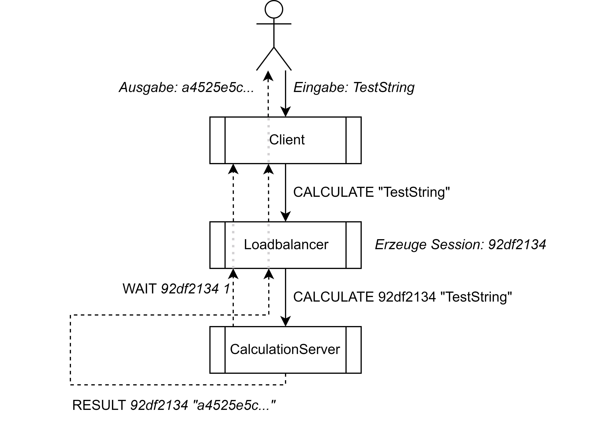

# VerteilteSystemeLoadbalancer

Kurzbeschreibung:
- Client kann eine Berechnung (10.000.000 mal SHA256) anfordern
- Client wählt durch Zufall einen Loadbalancer aus und schickt die Anforderung an ihn
- Loadbalancer verteilt diese Anforderungen an einen von mehreren CalculationServer über RoundRobin
- CalculationServer führt die angeforderte Berechnung durch und sendet das Ergebnis anschließend zurück an den Loadbalancer
- Loadbalancer leitet das Ergebnis weiter an den Client
<br/>

Voraussetzung:
- Client kennt alle Loadbalancer
- Loadbalancer kennt alle CalculationServer
<br/>

Anforderungen:
- Programmiersprache Java
- Strategien: [Round Robin](src/de/dhbw/loadbalancer/strategy/roundrobin/RoundRobin.java) & [zufällige Zuweisung](src/de/dhbw/loadbalancer/strategy/random/RandomBalancer.java)
- 3 Anwendungen: [Client](src/de/dhbw/loadbalancer/system/Client.java), [Loadbalancer](src/de/dhbw/loadbalancer/system/Loadbalancer.java), [CalculationServer](src/de/dhbw/loadbalancer/system/CalculationServer.java)

<br/>


Zu Demozwecken laufen alle Systeme auf dem gleichen Computer. Es stellt allerdings kein Problem dar, die Systeme verteilt zu starten.

## Übersicht

<br/><br/>

## Ablauf Berechnung: Skizze
In der Skizze ist der Ablauf einer Anfrage über alle 3 Anwendungen abgebildet.

<br/><br/>

## Ablauf Berechnung: Log
```
Client JNKAB sendet: CALCULATE "TestString"
```
Client sendet die Anfrage an einen Loadbalancer
<br/><br/>
```
Loadbalancer GITMV hat empfangen: CALCULATE "TestString"
```
Loadbalancer empfängt die Anfrage
<br/><br/>
```
Loadbalancer GITMV sendet: CALCULATE 92df2134 "TestString"
```
Loadbalancer erzeugt eine Session und leitet die Anfrage an einen CalculationServer weiter
<br/><br/>
```
CalculationServer ENOQX hat empfangen: CALCULATE 92df2134 "TestString"
```
CalculationServer empfängt die Anfrage und reiht diese in die Warteschlange ein
<br/><br/>
```
CalculationServer ENOQX sendet: WAIT 92df2134 1
```
CalculationServer sendet aktuelle Position der Warteschlange an den Loadbalancer zurück
<br/><br/>
```
Loadbalancer GITMV hat empfangen: WAIT 92df2134 1
```
Loadbalancer empfängt die aktuelle Position in der Warteschlange
<br/><br/>
```
Loadbalancer GITMV sendet: WAIT 92df2134 1
```
Loadbalancer leitet die aktuelle Position in der Warteschlange an den Client weiter
<br/><br/>
```
Client JNKAB hat empfangen: WAIT 92df2134 1
```
Client empfängt die aktuelle Position in der Warteschlange
<br/><br/><br/>
... etwa 10 Sekunden später ...
<br/><br/>
```
CalculationServer ENOQX sendet: RESULT 92df2134 "a4525e5c..."
```
CalculationServer ist mit der Berechnung fertig und sendet das Ergebnis an den Loadbalancer
<br/><br/>
```
Loadbalancer GITMV hat empfangen: RESULT 92df2134 "a4525e5c..."
```
Loadbalancer empfängt das Ergebnis
<br/><br/>
```
Loadbalancer GITMV sendet: RESULT 92df2134 "a4525e5c..."
```
Loadbalancer leitet das Ergebnis an den Client weiter
<br/><br/>
```
Client JNKAB hat empfangen: RESULT 92df2134 "a4525e5c..."
```
Client empfängt das Ergebnis
<br/><br/><br/>

## Ablauf Berechnung: Screenshots


<br/><br/>

## Queue-Thread
In der folgenden Skizze ist der Ablauf der [Queue](src/de/dhbw/loadbalancer/system/queue/Queue.java) eines CalculationServer.
<br/><br/>

<br/><br/>

## Tests
Einige Aspekte der Software wurden mit Unit-Tests getestet: [\*klick\*](test/de/dhbw/loadbalancer)
